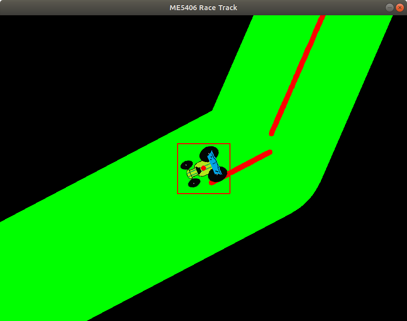
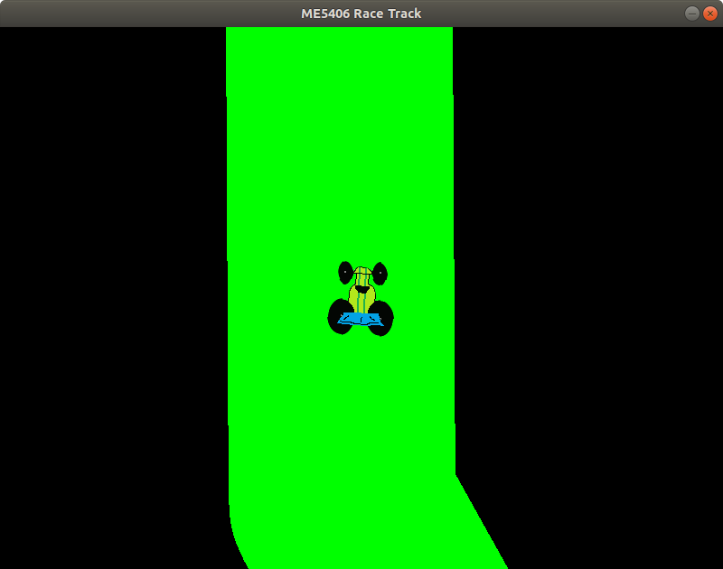
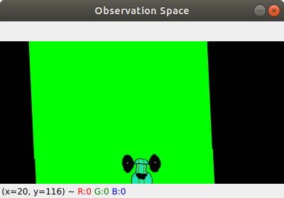

# ME5406

## Setup 
- Develop and test on Python3.6 in Ubuntu 18
```
sudo apt install python3-pip
python3 -m pip install --upgrade pip
python3 -m pip install virtualenv
```
- Setup virtualenv
```
python3 -m virtualenv env
source env/bin/activate
```
- Install python3 libraries
```
pip3 install -r requirements.txt
```

## Run
- Run `main.py` to start the simulation
```
python3 main.py 
```
- Override the methods `step`, `policy` and `reward` to customize your policy and reward function through inheritance
- Below is an example to use the race track environment with the step method overrided
```
from environment import Environment

class MyRaceTrack(Environment):
    def __init__(self):
        super().__init__()
        self.debug = False

    def run(self):
        while not self.crashed:
            action = self.policy()
            obs, reward, done, info = self.step(action)
            if done:
                self.reset()
        self.close()


if __name__ == "__main__":
    env = MyRaceTrack()
    env.run()
```
## Debug
- Run `environment.py` to start the simulation with debugging on
```
python3 environment.py
```
- Run `race_track.py` to debug the race track

## Simulator
- Pygame screen with/without debug enabled
<p align="center">
  
  
</p>
- Observation space always aligned uplight
<p align="center">
  
</p>