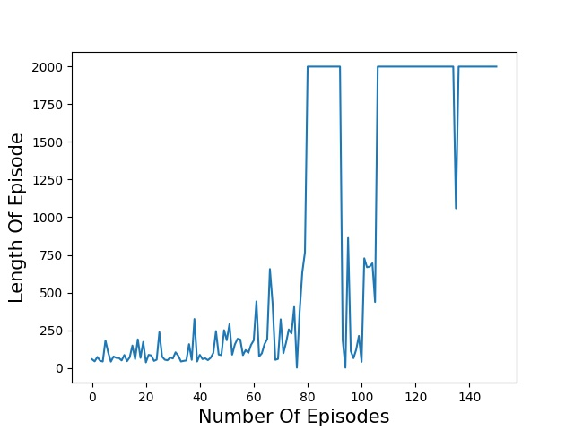
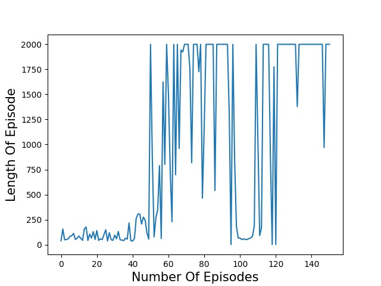
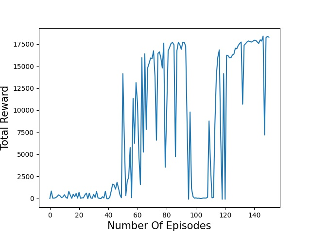
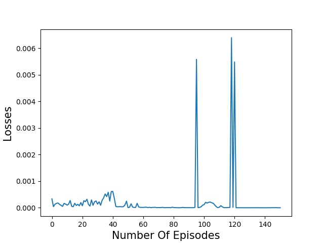
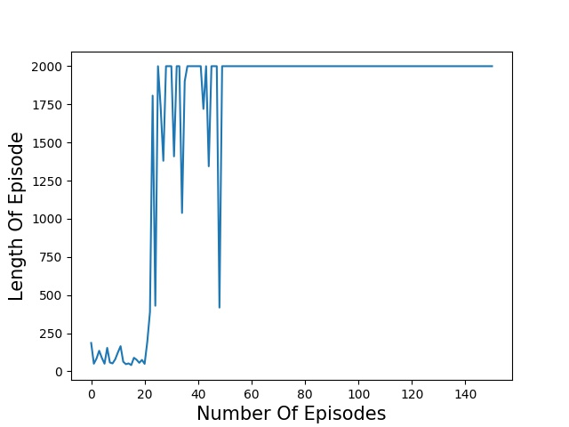
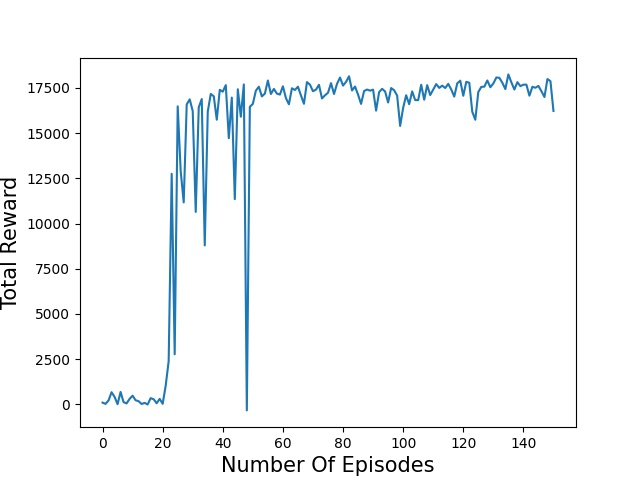
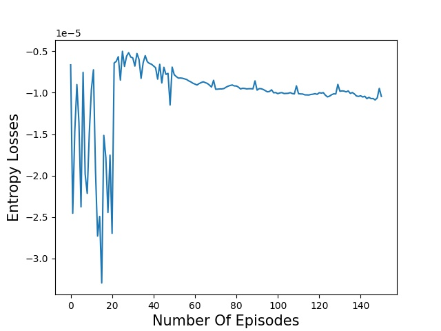
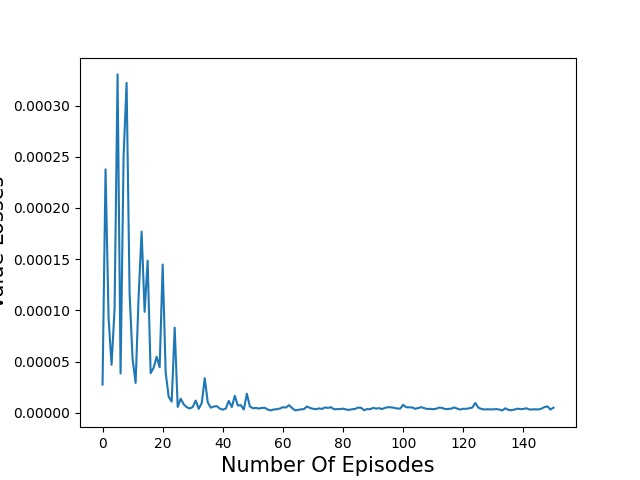

# ME5406

Group 60
- Ng Wei Jie, Brandon (A0184893L)
- Mohamad Haikal Bin Mohamad Yusuf (A0182446B) 
- Dennis Goh Wen Qin (A0096927L)


## Setup 
- Develop and test on Python3.6 in Ubuntu 18
```
sudo apt install python3-pip
python3 -m pip install --upgrade pip
python3 -m pip install virtualenv
```
- Setup virtualenv
```
python3 -m virtualenv env
source env/bin/activate
```
- Install python3 libraries
```
pip3 install -r requirements.txt
```

## Train RL Models
- Train DQN
```
is_eval=0 python3 main_dqn.py
```
- Train DDQN
```
is_eval=0 python3 main_ddqn.py
```
- Train A2C
```
is_eval=0 python3 main_a2c.py
```

## Evaluate RL Models
- Evaluate DQN (model is stored as `models/best_dqn.pt`)
```
is_eval=1 python3 main_dqn.py
```
- Evaluate DDQN (model is stored as `models/best_ddqn.pt`)
```
is_eval=1 python3 main_ddqn.py
```
- Evaluate A2C (model is stored as `models/best_a2c.pt`)
```
is_eval=1 python3 main_a2c.py
```

## Simulator
- Control simulator with keyboard
```
python3 demo.py
```

- Observation Space
<p align="center">
  
  
</p>
- Game Engine
<p align="center">
  
  
</p>

## Performance
- DQN
<p align="center">
  
  
  
</p>

- DDQN
<p align="center">
  
  
  
</p>

- A2C
<p align="center">
  
  
</p>
<p align="center">
  
  
  
</p>
